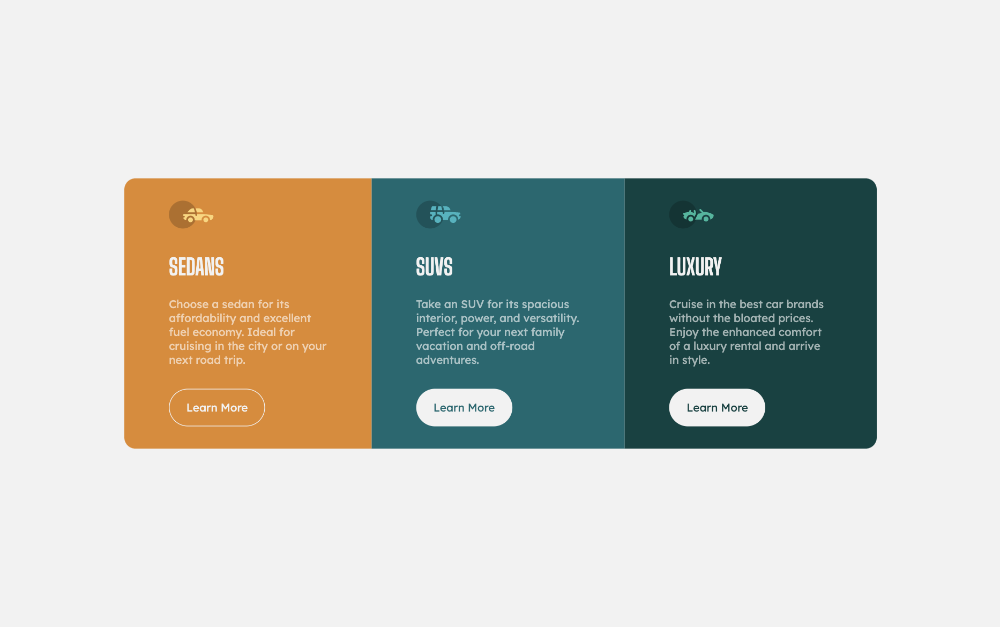

# Frontend Mentor - 3-column preview card component solution

This is a solution to the [3-column preview card component challenge on Frontend Mentor](https://www.frontendmentor.io/challenges/3column-preview-card-component-pH92eAR2-).

## Table of contents

- [Overview](#overview)
  - [The challenge](#the-challenge)
  - [Screenshot](#screenshot)
  - [Links](#links)
- [My process](#my-process)
  - [Built with](#built-with)
  - [What I learned](#what-i-learned)
- [Author](#author)

## Overview

I've learned how to build easy 3-column component. I've used SASS for the first time and I hope that code doesn't look that bad.
I've struggled with button positioning when resizing window and I'd need to fix that (tips on that would be helpful).

### The challenge

Users should be able to:

- View the optimal layout depending on their device's screen size
- See hover states for interactive elements

### Screenshot

### Links

- Live Site URL: [https://adamskys.github.io/3column-fementor/](https://adamskys.github.io/3column-fementor/)

## My process

### Built with

- Semantic HTML5 markup
- CSS custom properties
- Flexbox
- Mobile-first workflow
- SASS

### What I learned

Creating easy component using SASS (partially).

### Continued development

Learning more SASS as it looks as step up in writing CSS, taking care of positioning more. It wasn't that bad this time, however I can see that buttons are moving regardless the design.

### Useful resources

## Author

- Frontend Mentor - [@adamskys](https://www.frontendmentor.io/profile/adamskys)
